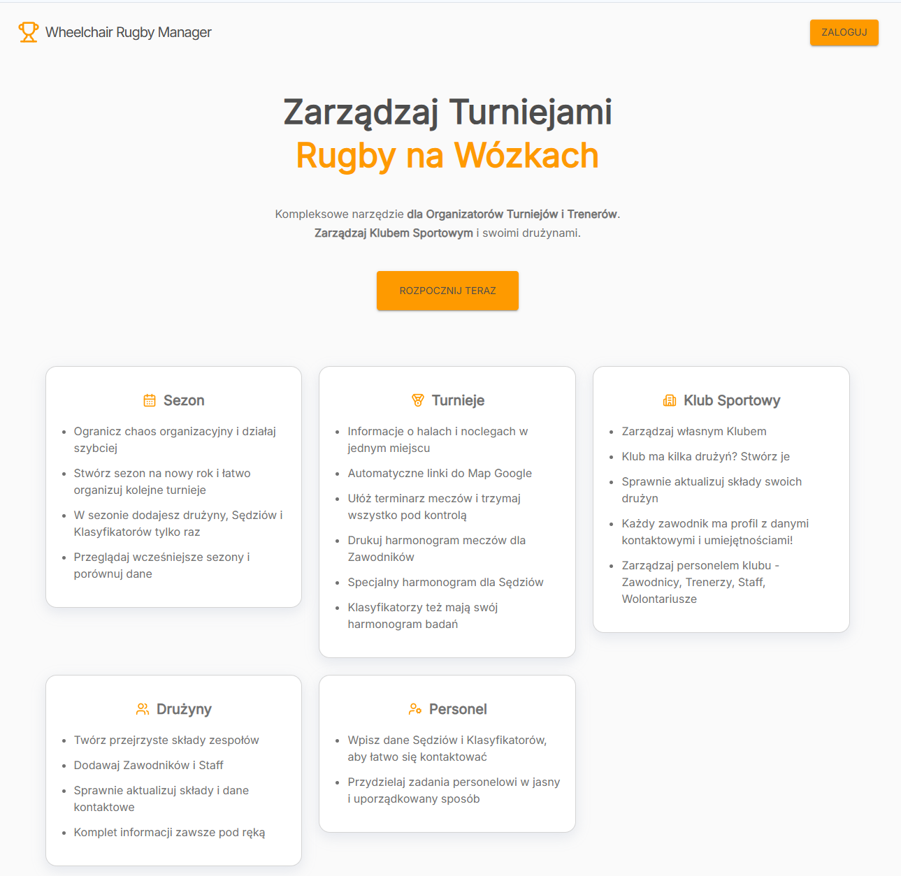
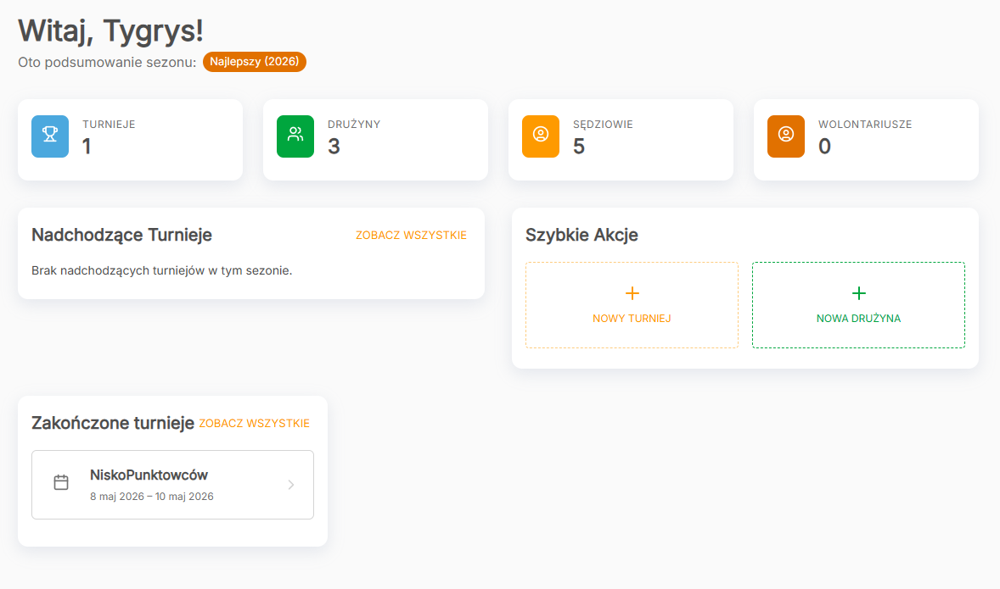
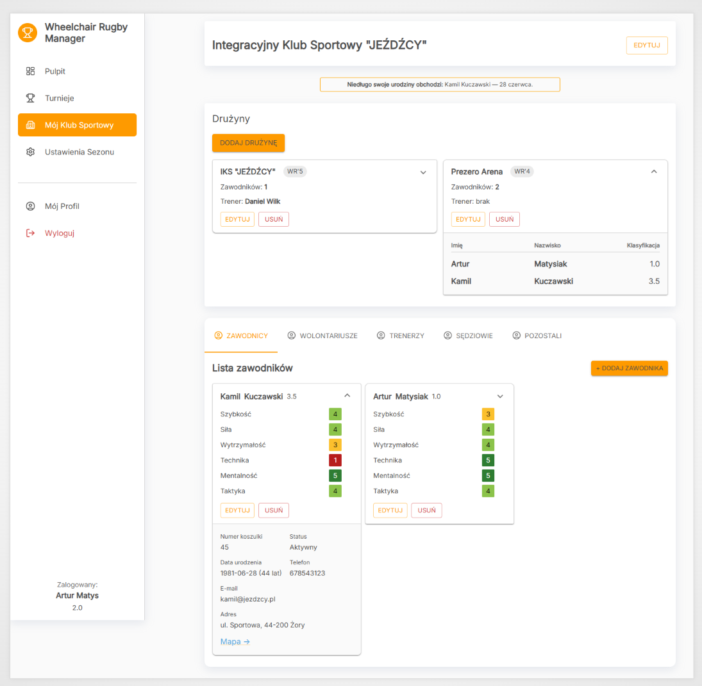
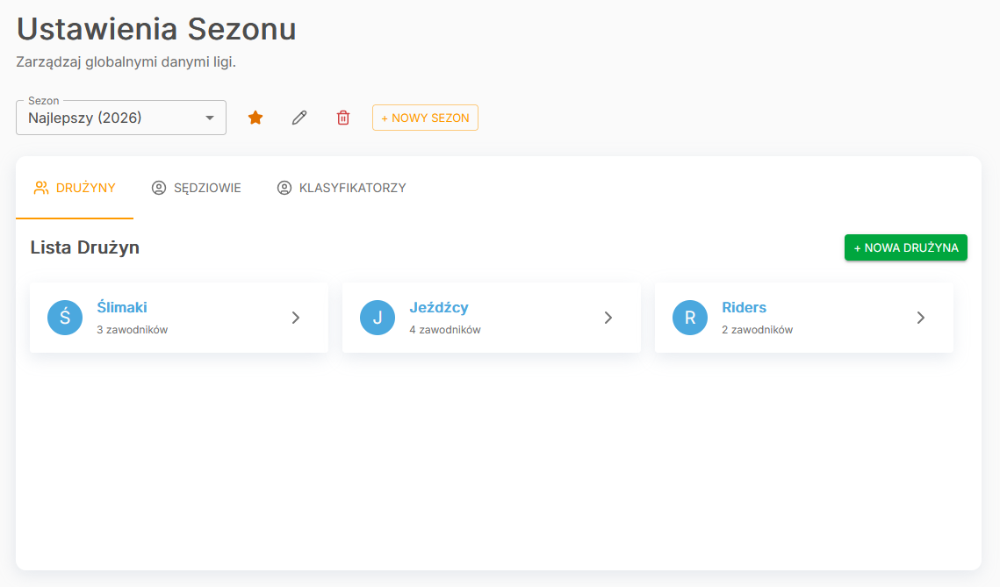
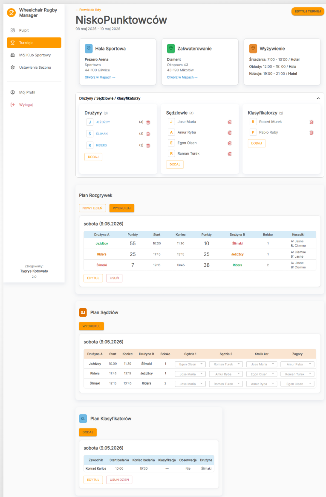
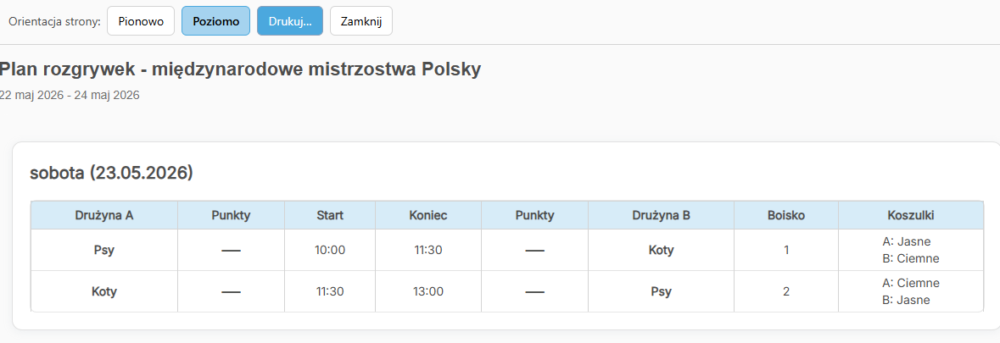

# 🏅 Wheelchair Rugby Manager

A comprehensive web application for managing wheelchair rugby tournaments and sports club team. Streamline tournament planning, team management, and match scheduling all in one place.








## ✨ Key Features

- 🎯 **Tournament Management** - Create and manage wheelchair rugby tournaments with detailed scheduling and match tracking
- 👥 **Team & Player Management** - Add players, coaches, and staff to your sports club
- 🏆 **Match Planning** - Organize matches, assign referees, and manage game schedules
- 📋 **Printing** - Print tournament reports and schedules
- ⚙️ **Settings** - Create Seasons, customize personnel information and tournament preferences

## 🚀 Project Versions

- **v.2** - Extended with simple team and player management system for sports clubs

## 🛠️ Tech Stack

- **Frontend**: React, TypeScript, Astro
- **Styling**: Material UI + global.css
- **Forms**: React Hook Form + Tanstack Query + Zod (on the backend to validate requests)
- **Database**: PostgreSQL + Prisma (ORM)
- **Testing**: Vitest - Unit tests for key components, React Testing Library - UI tests for components
- **State Management**: React hooks and context
- **Authentication**: SuperTokens
- **Hosting**: Vercel

## 📁 Project Structure

```
src/
├── features/                 # Feature modules (domain UI + logic)
│   ├── auth/                 # Login, landing, password reset, OAuth
│   ├── dashboard/            # Post-login home dashboard
│   ├── profile/              # User profile and account
│   ├── club/                 # Sports club and personnel
│   ├── teams/                # Team forms and details
│   ├── tournaments/          # Tournament planning and details
│   └── settings/             # Seasons and global settings
├── components/               # Shared layout, providers, hooks, generic UI
│   ├── AppShell/
│   ├── QueryProvider/
│   ├── ThemeRegistry/
│   ├── hooks/
│   └── ui/
├── layouts/                  # Astro page layouts
├── pages/                    # Astro routes (+ pages/api for REST)
├── lib/                      # Services, API clients, Prisma, auth helpers
├── styles/                   # global.css
└── types.ts                  # Shared DTOs and entities
```

Astro pages import React screens from `src/features/<module>/components/…` (with `.tsx` extension). Shared shell and reusable widgets stay in `src/components/`.

## 🎮 Main Features Overview

### Tournaments

- Create and plan tournaments
- Schedule matches and assign referees
- Track tournament progress
- View detailed match information

### Clubs & Teams

- Manage club information
- Add players and personnel
- Organize teams within clubs
- View Player skills

### Utilities

- Print tournament reports and schedules
- Generate match sheets

## 📝 Getting Started

1. Install dependencies with `pnpm install`.
2. Verify the `.env` file (or `.env.example`) provides a `DATABASE_URL` that points at your PostgreSQL instance and any other secrets you expect to override.
3. Run `pnpm prisma generate` so that `@prisma/client` can load the generated runtime (`.prisma/client/default` is missing until you do this).
4. (Optional) Seed the database with `pnpm run db:seed`.
5. Start the dev server via `pnpm run dev`.

> ⚠️ Whenever you reinstall dependencies or change the Prisma schema, rerun `pnpm prisma generate` before starting Astro. Skipping this step triggers the “Cannot find module '.prisma/client/default'” error when the API tries to instantiate `PrismaClient`.

---

**Built for the wheelchair rugby community** 🏆
